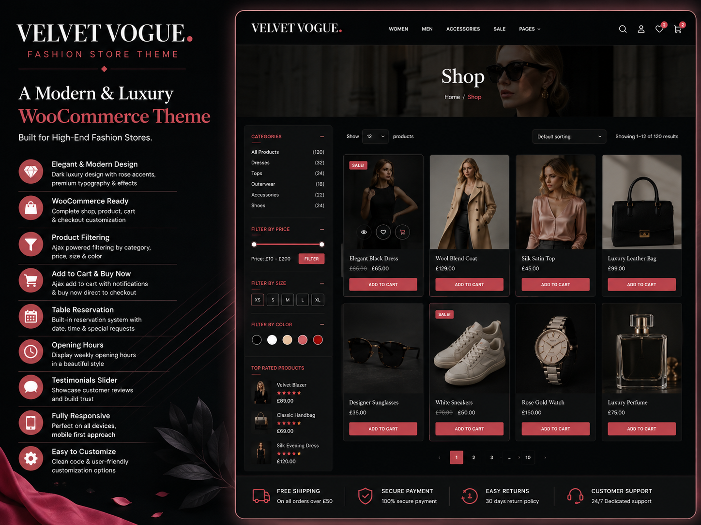
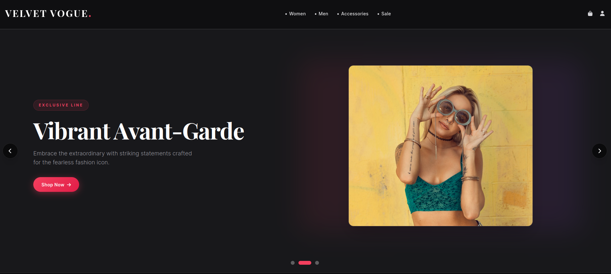
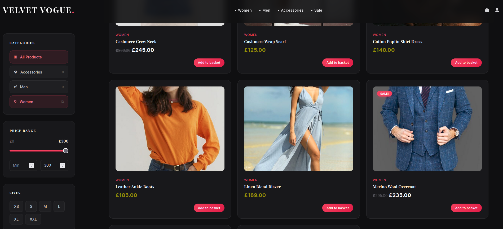
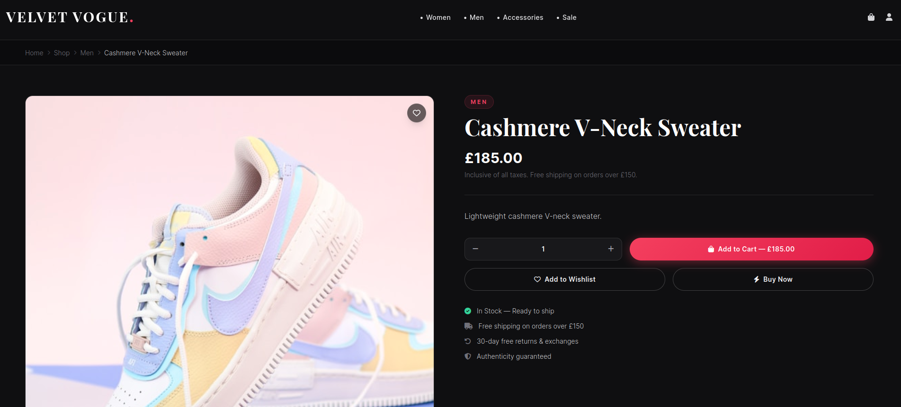
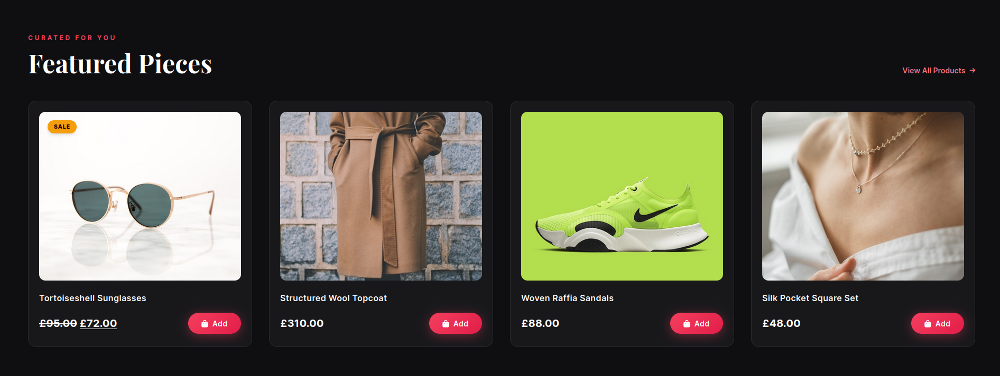

# Velvet Vogue Fashion Store

A premium dark luxury WooCommerce theme for high-end fashion e-commerce, built by **Shaik Obydullah**.

## Table of Contents

- [Overview](#overview)
- [Features](#features)
- [Requirements](#requirements)
- [Installation](#installation)
- [Theme Setup](#theme-setup)
- [Customizer Settings](#customizer-settings)
- [Companion Plugin](#companion-plugin)
- [Template Hierarchy](#template-hierarchy)
- [WooCommerce Integration](#woocommerce-integration)
- [JavaScript Features](#javascript-features)
- [CSS Architecture](#css-architecture)
- [File Structure](#file-structure)
- [Development](#development)
- [License](#license)

---

## Overview

Velvet Vogue is a WooCommerce-first WordPress theme featuring a dark luxury aesthetic with rose accent branding, custom product pages, client-side filtering, and a complete end-to-end shopping experience — from homepage hero through checkout and order confirmation.



| Page | Preview |
|---|---|
| Homepage |  |
| Shop |  |
| Single Product |  |
| Featured Products |  |

| Detail | Value |
|---|---|
| **Version** | 1.3.8 |
| **Author** | Shaik Obydullah |
| **License** | GPL v2+ |
| **Text Domain** | `velvet-vogue-fashion-store` |
| **WordPress** | 6.0+ (tested up to 6.6) |
| **PHP** | 7.4+ |
| **WooCommerce** | 8.0+ (tested up to 9.0) |

---

## Features

### Design
- Dark luxury aesthetic with near-black backgrounds (#0f0f11)
- Rose accent (#f43f5e) for CTAs, active states, and highlights
- **Playfair Display** serif headings + **Inter** sans-serif body
- Pill-shaped gradient buttons with glow hover effects
- Glassmorphism navigation with backdrop blur
- Spring-like cubic-bezier hover animations
- Fully responsive (mobile-first with sm/md/lg breakpoints)

### Homepage
- Hero slider with multiple slide support (CPT or Customizer-driven)
- Featured categories grid (4 columns)
- Featured products showcase (4 columns)
- Customer testimonials section (3 columns)

### WooCommerce
- Custom single product page with gallery, color/size selectors, tabs, related products
- Custom product card with data attributes for client-side filtering
- Custom cart page with 2-column layout (items + order summary)
- Custom checkout with progress bar and 2-column layout
- Animated order confirmation page
- AJAX add-to-cart with toast notifications
- "Buy Now" button — redirects directly to checkout
- Shop sidebar with category, price range, size, and color filters
- Full client-side product filtering without page reloads
- Classic checkout enforced (Blocks checkout disabled)

### Technical
- Dual-mode architecture: standalone theme or enhanced with companion plugin
- Custom image sizes for slider, cards, and categories
- Full i18n support with `velvet-vogue-fashion-store` text domain
- HTML5 markup support
- 4 registered menu locations
- 2 registered widget areas
- Unsplash fallback images when no media is uploaded

---

## Requirements

- WordPress 6.0+
- PHP 7.4+
- WooCommerce 8.0+
- MySQL 5.7+ or MariaDB 10.3+

---

## Installation

1. Download or clone the repository into `wp-content/themes/`
2. Activate the theme from **Appearance > Themes**
3. Install and activate **WooCommerce** plugin
4. Run the WooCommerce setup wizard
5. Import the sample database and media from the `documents/` folder (optional)

```bash
# Clone into themes directory
cd wp-content/themes/
git clone <repository-url> velvet-vogue-fashion-store
```

---

## Theme Setup

### Homepage
1. Go to **Settings > Reading** and set "Your homepage displays" to **A static page**
2. Create a new page and assign the **Homepage** template
3. The homepage assembles from 4 template parts automatically

### Navigation
1. Go to **Appearance > Menus**
2. Create a menu and assign it to the **Primary Menu** location
3. Create footer menus for **Footer — Shop**, **Footer — About**, and **Footer — Support**

### Logo
1. Go to **Appearance > Customize > Site Identity**
2. Upload your logo (recommended: 250×60px)

### Sample Content
Import the bundled SQL dump and media files from the `documents/` directory for a fully populated demo store.

---

## Customizer Settings

Accessible via **Appearance > Customize**:

### Homepage Hero
| Setting | Type | Description |
|---|---|---|
| Hero Kicker | Text | Small text above headline (e.g., "Autumn / Winter 2026") |
| Headline | Text | Main headline |
| Subheadline | Text | Secondary headline |
| Description | Textarea | Body copy below headlines |
| Hero Image | Image | Hero background image |
| CTA 1 Text / URL | Text / URL | Primary button |
| CTA 2 Text / URL | Text / URL | Secondary button |

### Footer
| Setting | Type | Description |
|---|---|---|
| Newsletter Text | Text | Newsletter signup description |
| Tagline | Text | Brand tagline in footer |
| Copyright | Text | Copyright notice |
| Social Links | URLs | Instagram, Pinterest, YouTube, TikTok |
| Quick Links | Text/URL pairs | 5 custom footer links |

---

## Companion Plugin

The theme works standalone but can be enhanced with the **VVFS Core** companion plugin, which provides:

### Custom Post Types
| CPT | Purpose |
|---|---|
| `vvfs_hero_slide` | Manage hero slider slides with kicker, subtitle, and featured image |
| `vvfs_testimonial` | Manage customer testimonials with quote, rating, avatar, and role |
| `vvfs_footer` | Manage footer content (tagline, social links, copyright) |

### Graceful Degradation
- **With plugin**: Content managed via admin CPTs
- **Without plugin**: Falls back to Customizer settings
- **Without either**: Falls back to hardcoded defaults

---

## Template Hierarchy

| Template | Context |
|---|---|
| `front-page.php` | Homepage (static front page) |
| `index.php` | Blog listing fallback |
| `single.php` | Individual blog posts |
| `page.php` | Static pages |
| `archive.php` | Category, tag, author, date archives |
| `search.php` | Search results |
| `404.php` | Not found page |
| `comments.php` | Comment rendering |
| `sidebar-shop.php` | Custom shop sidebar with filters |

### WooCommerce Templates (10 overrides)

| Template | Override |
|---|---|
| `content-product.php` | Product card with filter data attributes |
| `content-single-product.php` | Full custom single product page (477 lines) |
| `loop/loop-start.php` | Custom grid wrapper |
| `loop/loop-end.php` | Custom grid closer |
| `cart/cart.php` | 2-column cart layout |
| `cart/cart-empty.php` | Empty cart state |
| `single-product/add-to-cart/simple.php` | Styled quantity + button |
| `checkout/form-checkout.php` | Custom checkout with progress bar |
| `checkout/thankyou.php` | Animated order confirmation |

---

## WooCommerce Integration

### Product Attributes
- **Color** (`pa_color` / `color`): Renders as colored circle selectors with hex codes from term meta
- **Size** (`pa_size` / `size`): Renders as rectangular button selectors with stock awareness

### Client-Side Filtering
Product cards embed `data-` attributes for instant filtering:
- `data-price` — Numeric price
- `data-sizes` — Comma-separated sizes
- `data-color` — Color slug
- `data-category` — Space-separated category slugs

### Shop Sidebar Filters
- Category filter with product counts and contextual icons
- Price range slider (0–300) with min/max inputs
- Size toggle buttons (XS through XXL)
- Color swatch buttons (8 colors)
- Clear all filters button

### Buy Now Feature
The "Buy Now" button on single product pages:
1. JavaScript creates a hidden form with `buy_now=1`
2. PHP filter `woocommerce_add_to_cart_redirect` detects the flag
3. User is redirected directly to checkout (bypasses cart)

---

## JavaScript Features

### `main.js` (346 lines)
- **Toast notification system**: Global `vvfsShowToast(title, subtitle)` with progress bar and auto-dismiss
- **Mobile menu**: Hamburger toggle with animated icon swap
- **Hero slider**: Autoplay, dot navigation, prev/next arrows, touch swipe support
- **AJAX add-to-cart**: Fetch-based cart addition with spinner and toast
- **Client-side filtering**: Price, size, and color filters with loader overlay
- **Clear filters**: Full state and UI reset

### `product-details.js` (269 lines)
- **Thumbnail gallery**: Click-to-swap with opacity fade
- **Color/size selectors**: Custom attribute pickers (not WooCommerce dropdowns)
- **Variation matching**: Matches selected attributes to variation data, auto-updates image
- **Quantity controls**: +/- buttons with min/max enforcement
- **AJAX single add-to-cart**: Form submission via fetch
- **Buy Now**: Direct-to-checkout flow
- **Tab navigation**: Description / Specifications / Reviews tabs
- **Wishlist toggle**: Visual heart icon toggle

---

## CSS Architecture

### Load Order
1. `tailwind.css` — Tailwind CSS utilities (production build)
2. `base.css` — Global reset and typography
3. `theme.css` — Component styles (buttons, cards, slider, footer, mobile nav)
4. `main.css` — Layout helpers (archive, single, sidebar, shop sidebar, comments)
5. `woocommerce.css` — Complete WooCommerce overrides (2,285 lines)

### Design Tokens

| Token | Value |
|---|---|
| Background | `#0f0f11` |
| Card Background | `#18181b` |
| Primary Text | `#e4e4e7` |
| Secondary Text | `#a1a1aa` |
| Accent | `#f43f5e` |
| Success | `#22c55e` |
| Error | `#ef4444` |
| Star Rating | `#fbbf24` |
| Border | `rgba(255,255,255,0.08)` |

### Responsive Breakpoints
- `sm:` — 640px
- `md:` — 768px (sidebar visible, desktop nav, 2-col grids)
- `lg:` — 1024px (3-4 column grids, full shop layout)

---

## File Structure

```
velvet-vogue-fashion-store/
├── style.css                          # Theme metadata
├── functions.php                      # Core engine (508 lines)
├── header.php                         # Sticky nav + mobile menu
├── footer.php                         # 4-column footer
├── front-page.php                     # Homepage assembler
├── index.php                          # Blog listing fallback
├── page.php                           # Static pages
├── single.php                         # Single blog post
├── archive.php                        # Post archives
├── search.php                         # Search results
├── 404.php                            # Error page
├── comments.php                       # Comment rendering
├── sidebar-shop.php                   # Shop sidebar filters
├── template-parts/
│   ├── hero-slider.php                # Hero carousel
│   ├── featured-categories.php        # Category grid
│   ├── featured-products.php          # Product showcase
│   └── testimonials.php               # Customer reviews
├── woocommerce/
│   ├── content-product.php            # Shop product card
│   ├── content-single-product.php     # Single product page
│   ├── loop/
│   │   ├── loop-start.php
│   │   └── loop-end.php
│   ├── cart/
│   │   ├── cart.php                   # Custom cart
│   │   └── cart-empty.php             # Empty cart state
│   ├── single-product/add-to-cart/
│   │   └── simple.php                 # Simple product ATC
│   └── checkout/
│       ├── form-checkout.php          # Custom checkout
│       └── thankyou.php               # Order confirmation
├── assets/
│   ├── css/
│   │   ├── tailwind.css               # Tailwind utilities
│   │   ├── base.css                   # Reset + typography
│   │   ├── theme.css                  # Components
│   │   ├── main.css                   # Layout
│   │   └── woocommerce.css            # WC overrides
│   └── js/
│       ├── main.js                    # Core functionality
│       └── product-details.js         # Product page logic
└── documents/                         # Deployment materials (git-ignored)
```

---

## Development

### Custom Image Sizes
| Name | Dimensions | Use |
|---|---|---|
| `vvfs-slider` | 800×700 | Hero slider |
| `vvfs-card` | 600×700 | Product cards |
| `vvfs-category` | 600×700 | Category thumbnails |

### Registered Menus
| Location | Label |
|---|---|
| `primary` | Primary Menu |
| `footer_1` | Footer — Shop |
| `footer_2` | Footer — About |
| `footer_3` | Footer — Support |

### Registered Widget Areas
| ID | Name |
|---|---|
| `sidebar-blog` | Blog Sidebar |
| `sidebar-shop` | Shop Sidebar |

---

## License

GPL v2 or later — [GNU General Public License](https://www.gnu.org/licenses/old-licenses/gpl-2.0.html)
